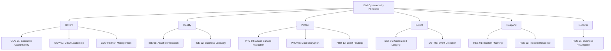
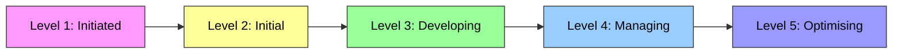
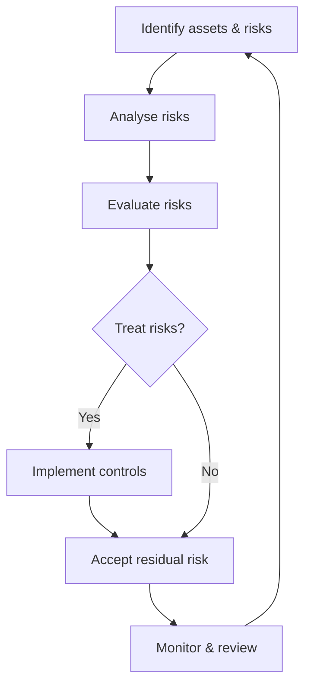
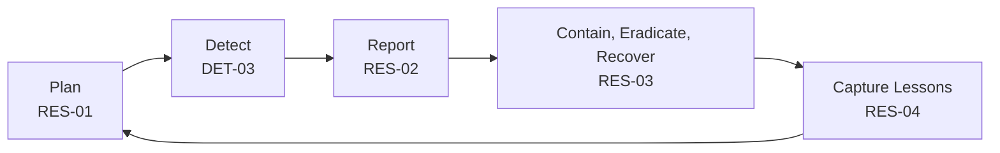

# 🎨 Visual Diagrams (Mermaid)

These diagrams help visualise the framework and processes.

---

## 1. Framework Overview

---

## 2. Maturity Progression

---

## 3. Risk Management Process (GOV-03 / IDE-04)

---

## 4. Incident Management Lifecycle

